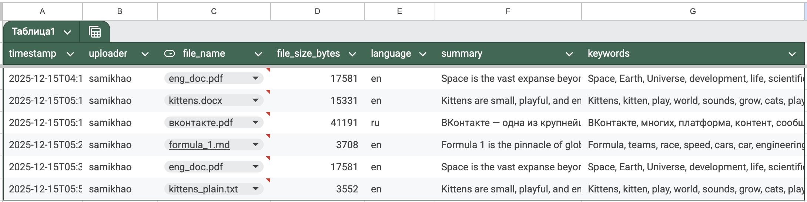
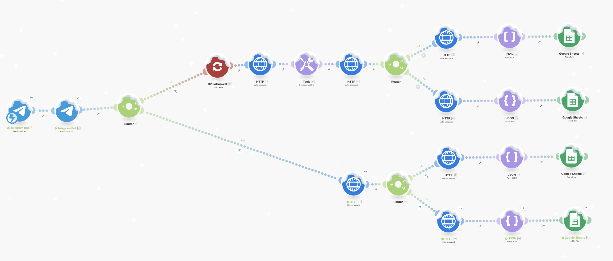

# ИИ-помогатор для баз знаний

Ссылка на таблицу:
[Результаты обработки документов](https://docs.google.com/spreadsheets/d/1XAr_r6eQEZpsb4AiEqNjBe-eVlhut4YcHcXkQD-LBmM/edit?usp=sharing)

В формате PDF -- `images/results.pdf`.

Экспортированная схема -- `scenario.json`.

Телеграм-бот:
@summarizer_AIbot

## Краткое описание работы

Пользователь отправляет файл в Telegram-бота. Файл приводится к единому формату, из текста извлекается краткое содержание и ключевые слова, после чего результаты и метаданные сохраняются в Google Sheets.

### Инструменты

- Про Make.com я раньше не слышала (знала только про n8n), поэтому решила попробовать. В процессе работы мне понравился интерфейс, и я остановилась на нём.
- YAKE, потому что для русского языка я не нашла стабильных и качественных экстракторов ключевых слов, которые нормально работали бы без обучения и сложной настройки. YAKE не зависит от языка, не требует разметки или моделей, предсказуемо работает в автоматическом пайплайне и даёт приемлемый результат для русских текстов.
- CloudConvert, потому что он поддерживает много форматов файлов, стабильно работает через API и хорошо встраивается в автоматический пайплайн. Верю, что есть более удобные решения, но найти не успела.
- FastAPI, ngrok - FastAPI использовался для того, чтобы обернуть YAKE в HTTP-сервис и вызывать экстрактор ключевых слов из Make.com обычным HTTP-запросом, не встраивая сам YAKE внутрь сценария автоматизации. По сути, FastAPI выступает как тонкий API-слой над локальным Python-кодом. Ngrok используется для проброса локального FastAPI-сервера во внешнюю сеть через временный публичный URL.

### Самая сложная часть

1. Выбор моделей. Если с суммаризатором особо проблем не было, работающего экстрактора ключевых слов для русского языка найти на HF не удалось, поэтому пришлось перейти на локальное решение - YAKE и пробросить его в сеть с помощью fastapi и ngrok.
2. CloudConverter. Возможно, существуют лучшие решения, но я остановилась на нём. Мало того, что токенов достаточно мало, так он ещё напрямую не принимает .txt-файлы. Долго искала методы сделать это элегантнее, но в итоге пришлось просто поставить роутер и продублировать оставшуюся часть пайплайна. Также CloudConverter добавляет мусорные символы при конвертации .md-файлов, а ещё переносы строки в тексте заменены на '\n', что ломает работу экстрактора ключевых слов - YAKE, поэтому пришлось добавить функции очистки туда же, где был поднят сам YAKE.

### Планируемые улучшения

1. OCR для обработки сканов, поиск похожих документов.
2. Уведомления пользователю о результате обработки.
3. Замена временных решений (ngrok, CloudConvert) на полностью локальные или более устойчивые альтернативы.
